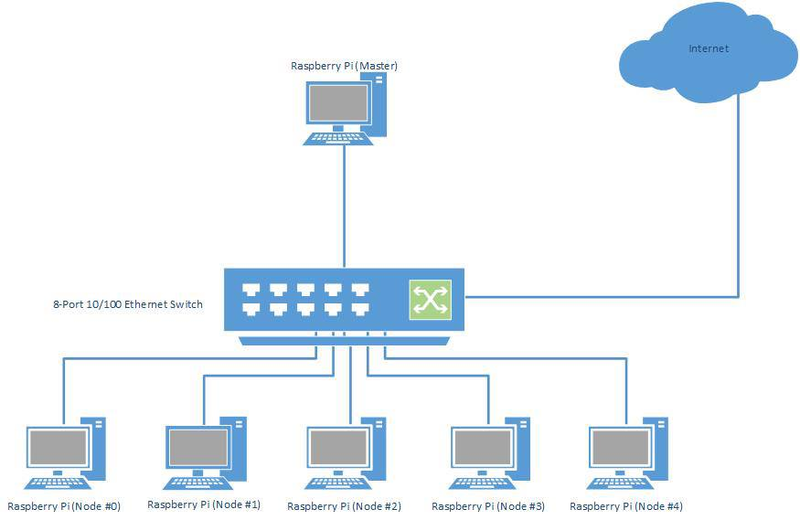

Architecture
============

.. highlight:: rest

-------------
System Design
-------------

*A chain is only as strong as its weakest link.*

In a distributed model super computer, this statement cannot be more true. No matter how 
quickly each individual node can process its allocated tasks, if the communications link 
between the master system and each of the slave nodes becomes a bottleneck, then the 
entire system will suffer in performance.

In order to produce an efficient, flexible and reliable system, the selection of a 
networking topology which can fulfil those three specific characteristics is crucial. By 
selecting the star network topology as the basis for the Punnet of Berries super computer, 
the key requirements of efficiency, flexibility and reliability are met.

Efficiency
----------
By design, star networks utilise a central hub such as a networking switch to
handle to flow of packets in a network. This allows data packets to only travel
to those nodes which they are intended for, reducing the overall traffic in the
network.

Flexibility
-----------
By utilising a central hub for communications, a star network can easily be
expanded to support additional nodes without affecting the entire network.
Furthermore nodes can be removed at any time, if servicing is required.

Redundancy
----------
By utilising a central hub for communications, the likelihood of total system
failure is greatly reduced. Whilst failure of the central hub would mean that
the entire system is brought down, failure of an individual node wouldn't have
any affect on the overall system.

--------------
Program Design
--------------

The Berry Batch will consist of a centralised manager daemon and worker daemons.

Each node in the Punnet of Berries cluster will run a Berry Batch worker daemon. These
workers exist to execute the jobs submitted to the system. The workers will:

    1. Wait to be assigned a job.
    2. Execute the job.
    3. Returns the job's exit status.
    4. Back to 1.

A job finished execution, with one of the following status:

    1. Successful
        The job finished execution within the requested time frame and resources and 
        without encountering any errors.
    2. Error
        The job encountered an error during execution.
    3. Walltime Exceeded
        The job exceeded the requested walltime and was terminated by Berry Batch.
    4. Resources Exceeded
        The job required more system resources than requested and was terminated by 
        Berry Batch.
        
The Berry Batch manager will monitor the system's resources and jobs. Users will interact 
directly with the Berry Batch manager to manage their job requests. A user is able to:

    - Submit jobs.
    - View all queued jobs.
    - View the status of all of a particular user's jobs.
    - View the status of a particular job.
    - Cancel their own jobs.

Submitting Jobs
---------------

Users will write job scripts, which will be passed to the Berry Batch manager. A job script
will consist of header and execution sections. The header section will specify the job 
details for queueing by Berry Batch. This could include a name for the job, the memory 
required, an estimated walltime and the number of nodes to run on. The execution section 
will contain the actual commands to be executed as a part of the job. While the job script's 
specific format is yet to be decided, an example is::

    ## Header Start ##
    Name="JobHello"
    Walltime=00:50:00
    Nodes=2
    Memory=256mb
    ## Header End ##

    mpirun -np 2 helloWorld

Once a job has been submitted, the Berry Batch manager will determine which priority queue 
the job should wait in based on the resources and walltime requested in the header section. 
The queues could be:

    - Short
    - Medium
    - Long
    - Special (requires permission from the Punnet of Berries administration to run)

The *special* queue has first priority, followed by the *long* queue, and so on. If the 
resources are not available for any job in the *special* queue, the manager will look in the
*long* queue for a suitable job, and so on. Each queue will operate in a *First in First Out* 
fashion.

Job Execution
-------------

Once a job has been submitted, it will move through the following states:

    1. Queued
    #. Running
    #. Complete
    #. Cancelled

When a job has completed, a Berry Batch job summary file will be written. This summary will 
contain details of the job's execution, such as the resources and walltime that were requested 
as well as what was actually used. Any standard output generated during execution will also be 
included in the summary file.
