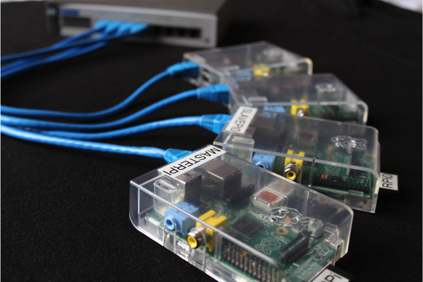
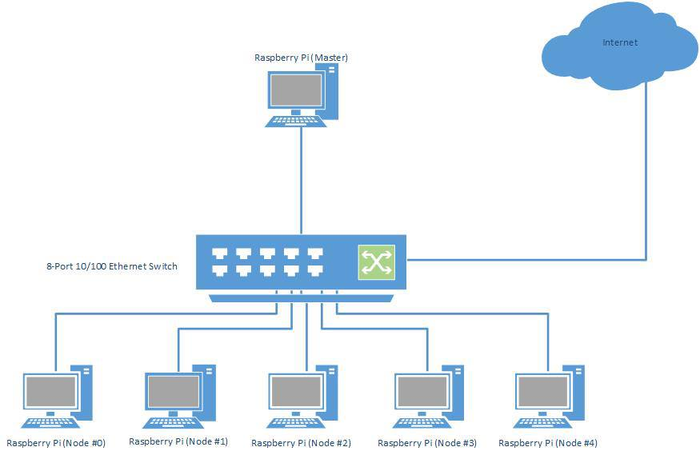

Architecture
============

.. highlight:: rest

--------
Hardware
--------
+-----------------+-----+------------------------------------+--------------+-----------+------------+
| Category        | Qty | Description                        | Supplier     | Unit Cost | Total Cost |
+=================+=====+====================================+==============+===========+============+
| Computer        |   6 | Raspberry Pi Model B 512MB         | element14    |    $41.80 |    $250.80 |
+-----------------+-----+------------------------------------+--------------+-----------+------------+
| Storage         |   6 | Assorted brands 8GB SD card        | MULTIPLE     |    $12.00 |     $72.00 |  
+-----------------+-----+------------------------------------+--------------+-----------+------------+
| Enclosure/Case  |   6 | Raspberry Pi Case (Clear)          | element14    |     $9.79 |     $58.74 |
+-----------------+-----+------------------------------------+--------------+-----------+------------+
| Power Supply    |   6 | Power Supply USB 5V/1.2A           | element14    |    $22.00 |    $132.00 |
+-----------------+-----+------------------------------------+--------------+-----------+------------+
| Ethernet Cables |   6 | 1.5m Cat-5e Patch Cable            | MULTIPLE     |     $3.00 |     $18.00 |
+-----------------+-----+------------------------------------+--------------+-----------+------------+
| Switch          |   1 | 8-Port 10/100 Mbps Ethernet Switch | UNKNOWN      |    $34.00 |     $34.00 |
+-----------------+-----+------------------------------------+--------------+-----------+------------+

The above table details the hardware components used to create the Punnet of Berries compute
cluster.

-------------
System Design
-------------
*A chain is only as strong as its weakest link.*

In a distributed model super computer, this statement cannot be more true. No matter how 
quickly each individual node can process its allocated tasks, if the communications link 
between the system's master and each of the slave nodes becomes a bottleneck, then the
entire system will suffer in performance.

In order to produce an efficient, flexible and reliable system, the selection of a 
networking topology which can fulfil those three specific characteristics is crucial. By 
selecting the star network topology as the basis for the Punnet of Berries super computer, 
the key requirements of efficiency, flexibility and reliability are met.

Efficiency
----------
By design, star networks utilise a central device, such as a networking switch, to
handle to flow of packets in a network. This allows data packets to only travel
to those nodes which they are intended for, reducing the overall traffic in the
network.

Flexibility
-----------
By utilising a central device for communications, a star network can easily be
expanded to support additional nodes without affecting the entire network.
Furthermore nodes can be removed at any time, if servicing is required.

Redundancy
----------
The likelihood of total system failure is greatly reduced by using a central device for
communication. The failure of an individual node wouldn't have any effect on the overall
system. However, the central device failing would be catastrophic, bringing the entire 
system down.

--------------------
The Operating System
--------------------
As discussed earlier, it was decided that **Arch Linux ARM** would be the Punnet of Berries'
operating system.

The following section describes the steps that were taken to configure a basic Arch Linux 
image for use in the compute cluster. The base image was obtained from the Raspberry Pi
downloads page (http://www.raspberrypi.org/downloads).

.. toctree::
   
    ProjectLogs/ArchLinuxARM_Image
