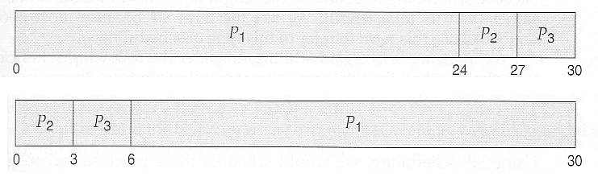

Program Design
==============

The Berry Batch consists of a centralised manager daemon and worker daemons. While the 
Punnet of Berries' centralised master node runs the manager daemon, each slave node runs 
a worker daemon.

The Berry Batch manager iteratively pulls submitted jobs from the queue and determines 
the most appropriate slave to carry out the job. This is done by monitoring the system's
resrouces and the jobs running or waiting. Users interact directly with the Berry 
Batch manager to manage their job requests. A user is able to:

    - Submit jobs.
    - View all queued jobs.
    - View the status of all of a particular user's jobs.
    - View the status of a particular job.
    - Cancel their own jobs.

The workers exist to execute the jobs submitted to the system. They operate in a polling 
fashion. They will:

    1. Wait to be assigned a job.
    2. Execute the job.
    3. Return the job's exit status.
    4. Back to 1.

---------------------
Scheduling Algorithms
---------------------
As discussed earlier in this document, the user is able to select which scheduling algorithm
the Berry Batch should use. The next few sections will outline the algorithms available.

First-Come-First-Served
-----------------------
The **First-Come-First Served (FCFS)** algorithm is very simple. As the name suggests, jobs 
are processed in the order that they are submitted. While the FCFS algorithm is very simple 
and easy to implement, its simplicity can also be its biggest flaw.

As shown in the following image, the waiting time for jobs in queue can vary greatly.

This is due to the running order being determined only by the job arrival time. Ignoring
other factors, such as the estimated length of the job, often results in the CPU and device
utilisation being lower than it could have been had shorter running jobs been scheduled first.
