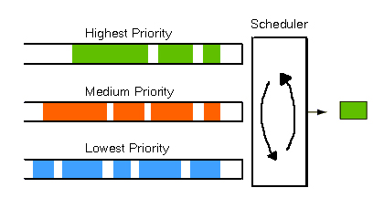
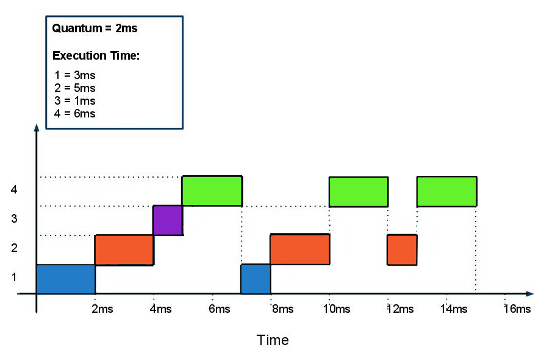

Program Design
==============
The Berry Batch consists of a centralised manager daemon and worker daemons. While the 
Punnet of Berries' centralised master node runs the manager daemon, each slave node runs 
a worker daemon.

.. image:: images/MasterAndSlaves.JPG
    :scale: 70%
    :align: center
    :alt: Master Pi and Slaves

The Berry Batch manager iteratively pulls submitted jobs from the queue and determines 
the most appropriate slave to carry out the job. This is done by monitoring the system's
resrouces and the jobs running or waiting. Users interact directly with the Berry 
Batch manager to manage their job requests. A user is able to:

    - Submit jobs.
    - View all queued jobs.
    - View the status of all of a particular user's jobs.
    - View the status of a particular job.
    - Cancel their own jobs.

The workers exist to execute the jobs submitted to the system. They operate in a polling 
fashion. They will:

    1. Wait to be assigned a job.
    2. Execute the job.
    3. Return the job's exit status.
    4. Back to 1.

---------------------
Scheduling Algorithms
---------------------
As discussed earlier in this document, the user is able to select which scheduling algorithm
the Berry Batch should use. The next few sections will outline the algorithms available.

First-Come-First-Served
-----------------------
The **First-Come-First Served (FCFS)** algorithm is very simple. As the name suggests, jobs 
are processed in the order that they are submitted. While the FCFS algorithm is very simple 
and easy to implement, its simplicity can also be its biggest flaw.

As shown in the following image, the waiting time for jobs in queue can vary greatly depending
on the order jobs are submitted.

.. image:: images/FCFS.jpg
    :scale: 70%
    :align: center
    :alt: FCFS

This is due to the running order being determined only by the job arrival time. Ignoring
other factors, such as the estimated length of the job, often results in the CPU and device
utilisation being lower than it could have been had shorter running jobs been scheduled first.

Priority Scheduling
-------------------
The **Priority scheduling** algorithm involves each job being assigned a priority. Jobs are 
then run based on their priority, with the highest priority being run first.

When a job is submitted, the Berry Batch manager determines which priority queue the job 
should be assigned to. This is done by taking into account the estimated walltime and the 
resources requested. The priority queues are:

+-----------+---------------+-------------+
| Priority  | Max Walltime  | Resources   |
|           | (minutes)     | (no. nodes) |
+===========+===============+=============+
| Low       |  15 mins      |     1 - 2   | 
+-----------+---------------+-------------+
| Medium    |  30 mins      |     1 - 3   |
+-----------+---------------+-------------+
| High      |  45 mins      |     2 - 4   |
+-----------+---------------+-------------+
| Special   |  > 60 mins    |     1 - 5   |
+-----------+---------------+-------------+

.. note::

    As jobs in the special queue require the entire cluster, these jobs need special
    permission from the Punnet of Berries administrator before running.

The *special* queue has first priority, followed by the *high* queue, and so on. If the 
resources are not available for any job in the *special* queue, the manager looks in the
*hight* queue for a suitable job, and so on. Within each queue, jobs are selected in a 
*First in First Out* fasion.

A problem that can occur with priority based scheduling is starvation. This means that low
priority jobs are forced to wait indefinitely or are never run. This can occur when jobs 
with higher priority are submitted before the low priority job runs, blocking the lower 
priority job.

There are two fixes to this problem.

    1. The job priorities can be re-evaluated based on how long they have been waiting. 
    This would prevent low priority jobs from never running. After they reach a pre-defined 
    wait threshold the job will be re-evalutated to a higher priority.

    2. One or two of the compute cluster's nodes could be reserved for low priority jobs. 
    These nodes would work their way through the low priority queue. Once the queue is empty, 
    the reserved nodes can be opened up to service the other queues. After completing jobs 
    from the higher priority queues, a check will be performed to determine if there are 
    jobs waiting in low priority queue.

Round-Robin
-----------
As a part of the **Round-Robin (RR)** scheduling algorithm a time *quantum* is defined, in 
milliseconds. The job queue is a *First in First Out* queue, with new jobs added to the end 
of the queue. Each job in the queue is picked one at a time and given running time. After a
time interval of 1 quantum, *q*, the job is paused and the next in the queue is started. Once the
end of the queue has been reached, the scheduler returns to the start of the queue, in 
Round-Robin fashion.

As each job only gets small intervals of running time, the average waiting time for jobs can
be longer. The job queue holds *n* jobs. Jobs with short walltimes can finish in a reasonable 
time. However, longer running jobs are continuously starting and stopping. These long running
jobs must wait a maxiumum of *(n-1)/q* time units before each time it runs.

If the time quantum is large enough, the RR algorithm can turn into FCFS. If the quantum is 
extremely small, the RR algorithm can create the apperance of each job having its processor.
However, the size of the quantum must make up for the overhead of stopping one job to start/
re-start another.
