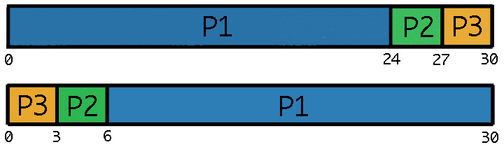

Program Design
==============

The Berry Batch consists of a centralised manager daemon and worker daemons. While the 
Punnet of Berries' centralised master node runs the manager daemon, each slave node runs 
a worker daemon.

The Berry Batch manager iteratively pulls submitted jobs from the queue and determines 
the most appropriate slave to carry out the job. This is done by monitoring the system's
resrouces and the jobs running or waiting. Users interact directly with the Berry 
Batch manager to manage their job requests. A user is able to:

    - Submit jobs.
    - View all queued jobs.
    - View the status of all of a particular user's jobs.
    - View the status of a particular job.
    - Cancel their own jobs.

The workers exist to execute the jobs submitted to the system. They operate in a polling 
fashion. They will:

    1. Wait to be assigned a job.
    2. Execute the job.
    3. Return the job's exit status.
    4. Back to 1.

---------------------
Scheduling Algorithms
---------------------
As discussed earlier in this document, the user is able to select which scheduling algorithm
the Berry Batch should use. The next few sections will outline the algorithms available.

First-Come-First-Served
-----------------------
The **First-Come-First Served (FCFS)** algorithm is very simple. As the name suggests, jobs 
are processed in the order that they are submitted. While the FCFS algorithm is very simple 
and easy to implement, its simplicity can also be its biggest flaw.

As shown in the following image, the waiting time for jobs in queue can vary greatly.

This is due to the running order being determined only by the job arrival time. Ignoring
other factors, such as the estimated length of the job, often results in the CPU and device
utilisation being lower than it could have been had shorter running jobs been scheduled first.

Priority Scheduling
-------------------
The **Priority scheduling** algorithm involves each job being assigned a priority. Jobs are 
then run based on their priority, with the highest priority being run first.

When a job is submitted, the Berry Batch manager determines which priority queue the job 
should be assigned to. This is done by taking into account the estimated walltime and the 
resources requested. The priority queues are:

    - Low
    - Medium
    - High
    - Special (requires permission from the Punnet of Berries administration to run)

The *special* queue has first priority, followed by the *high* queue, and so on. If the 
resources are not available for any job in the *special* queue, the manager looks in the
*hight* queue for a suitable job, and so on. Within each queue, jobs are selected in a 
*First in First Out* fasion.

A problem that can occur with priority based scheduling is starvation. This means that low
priority jobs are forced to wait indefinitely or are never run. This can occur when jobs 
with higher priority are submitted before the low priority job runs, blocking the lower 
priority job.

There are two fixes to this problem.

1) The job priorities can be re-evaluated based on how long they have been waiting. This
would prevent low priority jobs from never running. After they reach a pre-defined wait
threshold the job will be re-evalutated to a higher priority.

2) One or two of the compute cluster's nodes could be reserved for low priority jobs. These
nodes would work their way through the low priority queue. Once the queue is empty, the 
reserved nodes can be opened up to service the other queues. After completing jobs from the 
higher priority queues, a check will be performed to determine if there are jobs waiting in 
low priority queue.

Round-Robin
-----------
The **Round-Robin (RR)** scheduling algorithm
