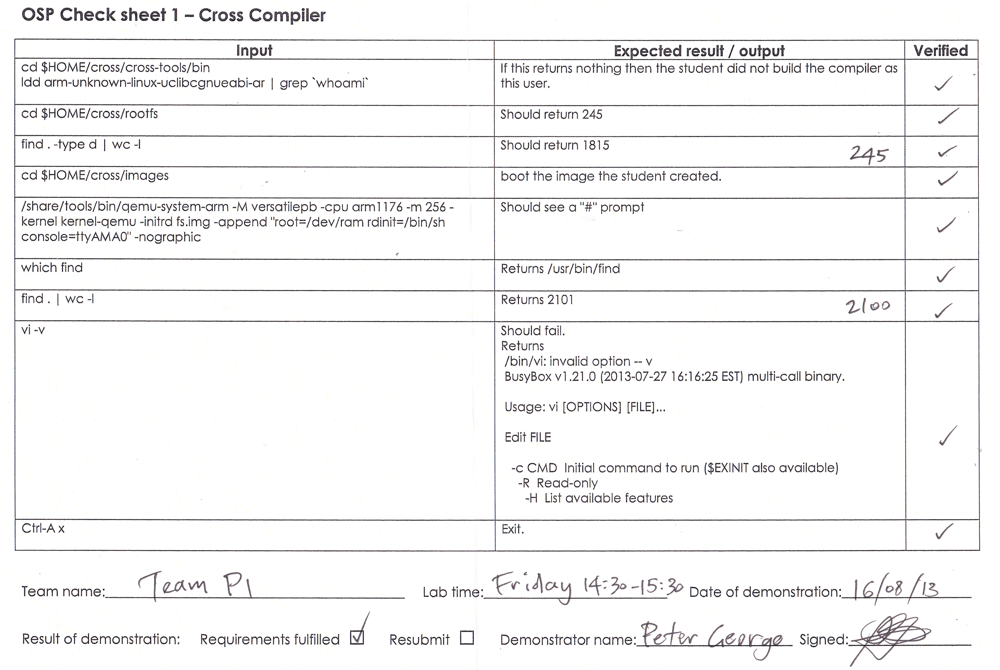

Self Assessment
===============
    :scale: 90%

.. image:: ProjectLogs/SelfAssessment1.jpg
    :align: center
    :alt: assessment 1
    :height: 18
    :width: 20

.. image:: ProjectLogs/SelfAssessment2.jpg
    :scale: 95%
    :align: center
    :alt: assessment 2

.. image:: ProjectLogs/SelfAssessment3.jpg
    :scale: 95%
    :align: center
    :alt: assessment 3

.. toctree::

    Methodology

------------
Milestone 01
------------

Reflection
----------
Milestone 1 involved following a cross-compiler recipe and becoming familiar working 
in a command line Unix environment.

The image was build by one TeamPi member, Alyssa Biasi. Alyssa already has considerable 
experience working on the command line. After spending some time getting to know the 
recommended tool, ``tmux``, she followed the instructions given in the recipe and 
performed the sanity check. No problems were encountered during the build. 

uClibc vs. glibc:
    Clibc was developed without consideration for other architectures and thus is a C 
    library targeted directly for embedded Linux. glibc was intended for higher output 
    performance and has additional features not required on a Raspberry Pi. The omitted
    features allow uClibc to function with a smaller amount of memory.

Cross-Compliers:
    A cross-compiler is critical in the creation of executables that are able to function
    on architectures that differ from the platform on which the code was developed.

Result
------

