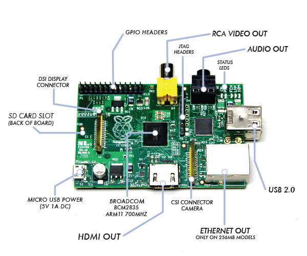

Project Pi - A Punnet of Berries
================================

------------
Introduction
------------
The Raspberry Pi is a single-board computer. This credit card sized device is capable of 
running Linux, and other light-weight operating systems, on its ARM processors. These 
portable "mini-computers" are low-cost, powerful devices; developed to educate and inspire 
the next generation.

---------------
System Overview
---------------